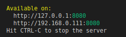

# **News App**
<!-- # To install the project, you need to take 3 steps. -->

+ enter commands into terminal

```
git clone https://github.com/alexrysukhin/news-app.git
```
```
cd news-app
```

+ install node.js

+ Enter the command into the terminal
```
npm install http-server -g
```

```
http-server
```

+ Two addresses will appear in the terminal


+ It is necessary to copy the second, as in this case `http://192.168.0.111:8080`
+ and enter it into the browser search bar